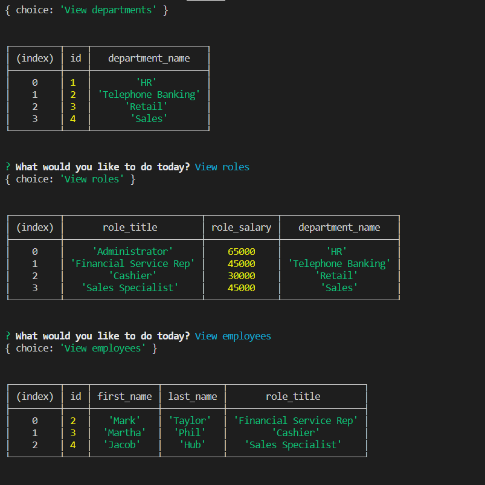

Employee Tracker
A CLI content management system for managing a company's employees using node, inquirer, and MySQL.

Links:
  Video: https://drive.google.com/file/d/1MR8FdZQjn2v1DEpOkAE6Hew3hl434w3A/view
  Github: https://github.com/iliasc8/Employee-Tracker.git

User Story
As a business owner
I want to be able to view and manage the departments, roles, and employees in my company
So that I can organize and plan my business
This application allows the user to:
•	Add departments, roles, employees
•	View departments, roles, employees
•	Update employee roles

How to Use
Open your terminal and change into the corresponding directory. Run "node app.js" and you will be prompted with options.
Database
The database contains three tables:
•	department:
o	id - INT PRIMARY KEY
o	name - VARCHAR(30) to hold department name
•	role:
o	id - INT PRIMARY KEY
o	title - VARCHAR(30) to hold role title
o	salary - DECIMAL to hold role salary
o	department_id - INT to hold reference to department role belongs to
•	employee:
o	id - INT PRIMARY KEY
o	first_name - VARCHAR(30) to hold employee first name
o	last_name - VARCHAR(30) to hold employee last name
o	role_id - INT to hold reference to role employee has
o	manager_id - INT to hold reference to another employee that manager of the current employee

 -->